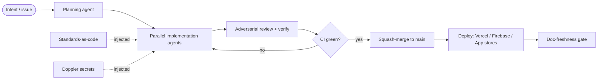
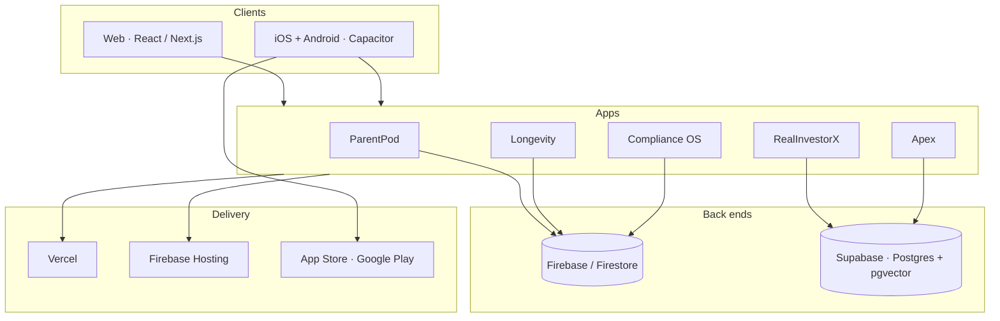

# Rock McKenzie

**Reliability & systems engineer — 12 years keeping the power grid reliable. Nights and weekends, I build and operate a portfolio of production apps, solo, on an agent-automation platform I designed.**

Director of Reliability Compliance at Invenergy by day. The rest of the time I ship consumer and data apps end-to-end — design, code, mobile, infra, deploy — and the interesting part isn't any single app. It's that *one person* runs all of them, because the tooling around the code does the repetitive work under review.

The full portfolio lives at **[beyondvolatility.com](https://beyondvolatility.com)**. Currently focused on **[ParentPod](https://parentpodapp.com)** (live on iOS, Android, and web).

---

## How this ships — one engineer, an agent platform

I treat my own development like a distributed system. Intent goes in; reviewed, tested, deployed changes come out across nine repositories. A shared **standards-as-code** library and a set of **release-gate commands** are the control plane; AI agents are the execution layer I orchestrate — including fan-out for parallel work and an adversarial review pass before anything merges.

The same seven standards documents are symlinked into every repo *and* into every agent's context, so a security or TypeScript rule is enforced identically whether I'm writing the code or an agent is. That consistency is what makes solo-operating a multi-app portfolio tractable.

## Ecosystem architecture

Full-stack across two back ends, three delivery targets, and native mobile — chosen per app, not by default.

## How I engineer

- **Types first.** TypeScript `strict`, no `any`; validate external input with Zod at the boundary and trust the types inside. Make impossible states unrepresentable.
- **Tests prove behavior.** A bug fix starts with a failing test that reproduces it. Keep the build and tests green before merge.
- **Security by default.** One secret store (Doppler) — never committed, never printed. Access enforced in Firestore rules / Postgres RLS, not just app code. OWASP-current, security headers, tight CSP.
- **Small, honest changes.** The minimum diff that fully solves the problem; delete what you replace; no drive-by refactors.
- **Ship on green.** branch → PR → CI → auto-merge → deploy, CLI-first. Docs, changelog, and version are gated so they can't drift from the shipped product.

---

<!-- SHOWCASE:START -->

## Portfolio

### Consumer

#### **[ParentPod](https://parentpodapp.com)** — `Flagship · live`
Coordination layer for co-parents and caregivers — one shared, real-time timeline for feeds, naps, meds, and handoffs, with role-scoped caregiver access.

**Stack:** TypeScript · React · Vite · Capacitor · Firebase — iOS / Android / Web

  - Published on the App Store and Google Play; web on Vercel
  - Offline-first Capacitor app; Firestore security rules enforce multi-caregiver access server-side
  - Native in-app purchases via RevenueCat, with a live growth/analytics dashboard

#### **Longevity** — `Active`
Recovery & wellness companion — habit streaks, daily check-ins, and relapse-prevention tooling, with money-saved and trigger-pattern views.

**Stack:** TypeScript · Next.js · React · Capacitor · Firebase — Web / iOS / Android

  - Next.js + Capacitor; accessible Radix UI; Sentry-instrumented
  - Firestore back end with hardened security headers and CSP

### Data & analysis

#### **RealInvestorX** — `Active`
Real-estate deal-analysis workspace — underwrite, compare, and semantically search deals.

**Stack:** TypeScript · React · Express · Turborepo · Supabase — Web

  - Turborepo monorepo — React client + Express API + shared packages
  - Supabase Postgres with pgvector for semantic deal search
  - Auth hardening in progress: HttpOnly-cookie session cutover off client-side token storage

#### **Apex** — `Maintained`
Personal-finance tracker — import, categorize, and chart cash flow and net worth.

**Stack:** TypeScript · React · Vite · Supabase — Web

  - React + Vite SPA on Supabase (Postgres + row-level security)
  - Spreadsheet-style importer with copy-paste ingestion

### Platform

#### **Compliance OS** — `Maintained`
Controls & audit-evidence platform — map policies to controls to evidence, with review workflows and audit-ready exports.

**Stack:** TypeScript · React · Firebase — Web

  - Full-stack evidence management with rich-text authoring (TipTap)
  - Firebase back end; role-based review workflows

#### **[Beyond Volatility](https://beyondvolatility.com)** — `Live`
Public hub and blog — the front door to the portfolio and long-form writing on energy, engineering, and building in the open.

**Stack:** WordPress · PHP — Web

  - Custom child theme; the canonical public index of every product

## By the numbers

| | |
|---|---|
| **Repositories** | 9 product repos + a shared engineering library |
| **Commits** | ~5.9K across the portfolio |
| **Source** | ~678K lines of tracked code (3.6K files) |
| **In production** | 4 apps live; ParentPod shipped to iOS + Android |
| **Back ends** | Firebase · Supabase (Postgres + pgvector) |
| **Languages** | TypeScript / React · JavaScript / Node · SQL (Postgres) · PHP |

Snapshot as of Jul 2026. App repositories are private; metrics are aggregated from them.

## The engineering system behind it

A standards-as-code engineering library plus an AI-agent orchestration layer that turns intent into reviewed, tested, deployed changes across every repo.

**Release-gate commands** (one library, every repo):

| Command | What it does |
|---|---|
| `/ship` | release gate — version bump, build, test, deploy, auto-merge, doc-freshness check |
| `/sync` | pull/rebase main, auto-resolve mechanical conflicts |
| `/audit` | security, dependency, dead-code, a11y & perf sweep |
| `/new-project` | scaffold a repo with standards, CI, secrets, and a context primer |
| `/update-brain` | maintain the knowledge base — ingest sessions, prune, reconcile the task hub |
| `/improve` | fold a sharper prompt back into the matching skill so it compounds |

**Standards-as-code:** `architecture` · `coding-standards` · `typescript` · `react` · `security` · `git-workflow` · `startup` — plus 8 reusable skills.

- Standards-as-code: one library, symlinked into every repo and every agent's context
- Multi-agent workflows: fan-out implementation, adversarial review, verify before merge
- Secrets from a single source (Doppler) — never committed, never printed
- branch → PR → CI green → auto-merge → deploy, CLI-first to keep it cheap
- Automated doc-freshness gates block a release on stale README / changelog / version

<!-- SHOWCASE:END -->

---

App repositories are private — this work ships to production, not to public forks. This page is regenerated from a single data source by a scheduled GitHub Action; see [`scripts/generate-showcase.mjs`](scripts/generate-showcase.mjs).

**If you're here from a resume or a referral, [beyondvolatility.com](https://beyondvolatility.com) is the best place to start.**
