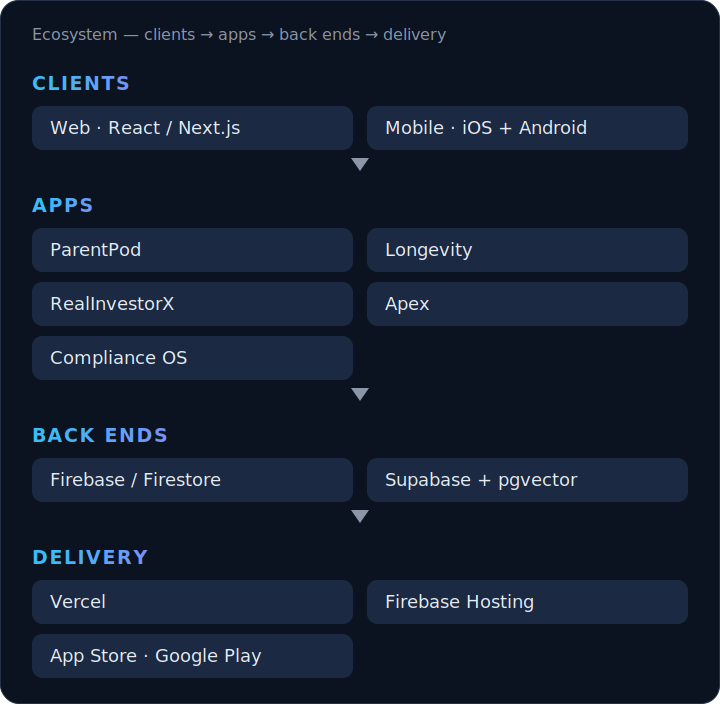

  
  
  
  
  
  
  
  
  

By day, reliability compliance at a large energy company — 12 years keeping the power grid up. Nights and weekends, I design, build, ship, and operate every app below **solo**, on an agent-automation platform I built so the repetitive work happens *under review* instead of by hand.

 

 

 

<!-- SHOWCASE:START -->

## Portfolio

### Consumer

#### [ParentPod](https://parentpodapp.com) — `Flagship · live`
Coordination layer for co-parents — one real-time shared timeline for feeds, naps, meds, and handoffs, with role-scoped caregiver access.  
**TypeScript · React · Vite · Capacitor · Firebase** · iOS / Android / Web

- Live on the App Store and Google Play; offline-first Capacitor build
- Firestore rules enforce multi-caregiver access server-side; native IAP via RevenueCat

#### Longevity — `Active`
Habit & wellness companion — streaks, daily check-ins, and progress insights.  
**TypeScript · Next.js · React · Capacitor · Firebase** · Web / iOS / Android

- Next.js + Capacitor; accessible Radix UI; Sentry-instrumented, hardened CSP

### Data & analysis

#### RealInvestorX — `Active`
Real-estate deal-analysis workspace — underwrite, compare, and semantically search deals.  
**TypeScript · React · Express · Turborepo · Supabase** · Web

- Turborepo monorepo; Supabase Postgres + pgvector for semantic deal search
- In-flight: HttpOnly-cookie session cutover off client-side token storage

#### Apex — `Maintained`
Personal-finance tracker — import, categorize, and chart cash flow and net worth.  
**TypeScript · React · Vite · Supabase** · Web

- React + Vite on Supabase (Postgres + row-level security); spreadsheet-style importer

### Platform

#### Compliance OS — `Maintained`
Controls & audit-evidence platform — map policies to controls to evidence, with review workflows.  
**TypeScript · React · Firebase** · Web

- Full-stack evidence management with rich-text authoring; role-based review workflows

#### [Beyond Volatility](https://beyondvolatility.com) — `Live`
Public hub and blog — the front door to the portfolio and long-form writing.  
**WordPress · PHP** · Web

- Custom child theme; the canonical public index of every product

## The engineering system behind it

A standards-as-code library plus an agent-orchestration layer turns intent into reviewed, tested, deployed changes across every repo — including parallel fan-out and an adversarial review pass before merge.

| Command | What it does |
|---|---|
| `/ship` | release gate — version, build, test, deploy, auto-merge, doc-freshness |
| `/sync` | rebase main, auto-resolve mechanical conflicts |
| `/audit` | security, dependency, dead-code, a11y & perf sweep |
| `/new-project` | scaffold a repo with standards, CI, secrets, context primer |
| `/update-brain` | maintain the knowledge base and reconcile the task hub |
| `/improve` | fold a sharper prompt back into a skill so it compounds |

**Standards-as-code:** `architecture` · `coding-standards` · `typescript` · `react` · `security` · `git-workflow` · `startup` — symlinked into every repo *and* every agent's context, plus 8 reusable skills.

<!-- SHOWCASE:END -->

---

App repositories are private — this work ships to production, not public forks. Everything here (metrics, diagrams, portfolio) is regenerated from a single data file by <a href="scripts/generate-showcase.mjs"><code>scripts/generate-showcase.mjs</code></a>, SVGs included. The full portfolio lives at <b><a href="https://beyondvolatility.com">beyondvolatility.com</a></b>.
