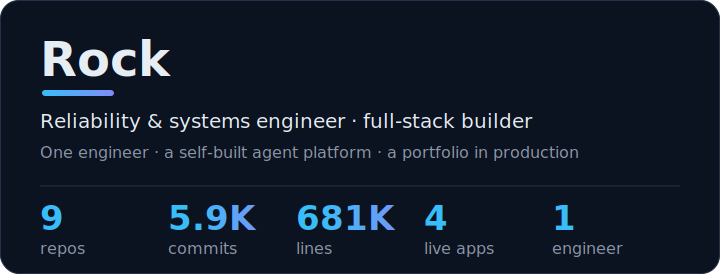
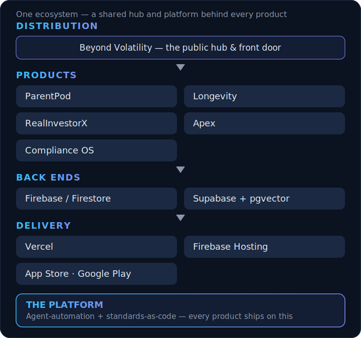
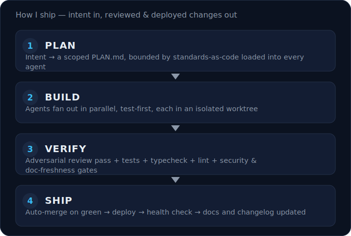
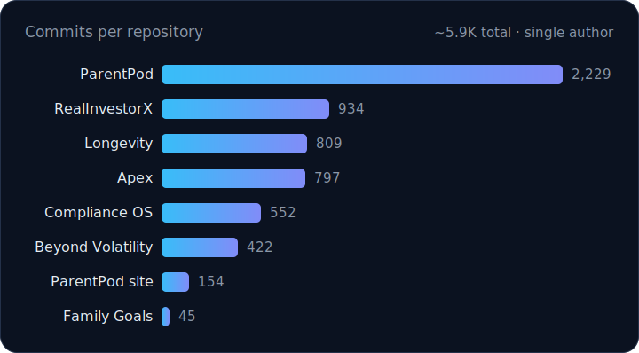
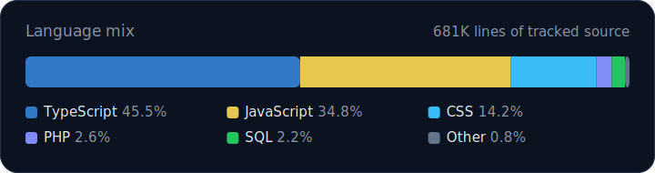

  
  
  
  
  
  
  
  
  
  
  

  <a href="#what-i-build">What I build</a>
  &nbsp;·&nbsp;
  <a href="#the-ecosystem">Ecosystem</a>
  &nbsp;·&nbsp;
  <a href="#how-i-ship">How I ship</a>
  &nbsp;·&nbsp;
  <a href="#by-the-numbers">By the numbers</a>
  &nbsp;·&nbsp;
  <a href="#selected-work">Selected work</a>
  &nbsp;·&nbsp;
  <a href="#engineering-practices">Practices</a>
  &nbsp;·&nbsp;
  <a href="#connect">Connect</a>

## What I build

By day, reliability compliance at a large energy company — 12 years keeping the power grid up. Nights and weekends, I design, build, ship, and operate every product below **solo**, on an agent-automation platform I built so the repetitive engineering happens *under review* instead of by hand. The numbers above aren't a team's output — they're one engineer with a lot of leverage.

**Currently**

- Scaling **ParentPod** — live on iOS & Android; running growth experiments against fixed survival checkpoints.
- **Longevity** on deck — a privacy-first wellness companion, hardening for launch.
- Evolving the **agent-automation platform** — parallel fan-out, an adversarial review pass, and doc-freshness gates.

## The ecosystem

9 repositories, one system: a shared hub for distribution, a portfolio of products, two back ends, and native + web delivery — all resting on the automation platform.

  

## How I ship

  

A standards-as-code library plus an agent-orchestration layer turns intent into reviewed, tested, deployed changes across every repo — parallel fan-out, an adversarial review pass, and a doc-freshness gate before merge.

| Command | What it does |
|---|---|
| `/ship` | release gate — version, build, test, deploy, auto-merge, doc-freshness |
| `/sync` | rebase main, auto-resolve mechanical conflicts |
| `/audit` | security, dependency, dead-code, a11y & perf sweep |
| `/new-project` | scaffold a repo with standards, CI, secrets, context primer |
| `/update-brain` | maintain the knowledge base and reconcile the task hub |
| `/improve` | fold a sharper prompt back into a skill so it compounds |

**Standards-as-code:** `architecture` · `coding-standards` · `typescript` · `react` · `security` · `git-workflow` · `startup` — one library, symlinked into every repo *and* loaded into every agent's context, plus 8 reusable skills.

## By the numbers

Real figures, aggregated across every repository — public *and* private. No third-party stat widgets; these are computed from the actual git history and source tree, then drawn from data.

## Selected work

| Project | What it does | Stack | Live |
|---|---|---|---|
| **[ParentPod](https://parentpodapp.com)**  `Flagship · live` | The village operating system for modern parenting teams. | TypeScript · React · Vite · Capacitor · Firebase | [App Store ↗](https://apps.apple.com/app/parentpod/id6759841193) · [Play ↗](https://play.google.com/store/apps/details?id=com.parentpod.app) |
| **[Longevity](https://longevity.beyondvolatility.com/)**  `On deck` | Privacy-first wellness, across ten dimensions. | TypeScript · Next.js · React · Capacitor · Firebase | [Live ↗](https://longevity.beyondvolatility.com/) |
| **[RealInvestorX](https://realestate.beyondvolatility.com/)**  `Active` | Institutional-grade real-estate deal analysis. | TypeScript · React · Express · Turborepo · Supabase | [Live ↗](https://realestate.beyondvolatility.com/) |
| **[Apex](https://personalfinance.beyondvolatility.com/)**  `Maintained` | Personal-finance & FIRE planning. | TypeScript · React · Vite · Supabase | [Live ↗](https://personalfinance.beyondvolatility.com/) |
| **[Compliance OS](https://compliance.beyondvolatility.com/)**  `Maintained` | Controls & audit-evidence platform. | TypeScript · React · Firebase | [Live ↗](https://compliance.beyondvolatility.com/) |
| **[Beyond Volatility](https://beyondvolatility.com)**  `Live` | The hub — the front door to the portfolio. | WordPress · PHP | [Live ↗](https://beyondvolatility.com) |

<b>ParentPod — deep dive</b>

**Problem.** Caring for a baby is a team sport, but the tools assume one logged-in parent — state fragments across people and devices.

**Architecture.** React + Vite in a Capacitor shell (one codebase → iOS, Android, Web). Firestore for real-time multi-caregiver sync; security rules enforce role-scoped access server-side; RevenueCat for cross-platform subscriptions; voice logging and AI insight summaries.

**Engineering.** Offline-first with optimistic writes and conflict-safe merges; the same automated release gate ships web (Vercel) and native (App Store / Play) from one push.

<b>Full stack &amp; tooling</b>

**Languages**  
     

**Frontend**  
     

**Backend**  
     

**Infra & delivery**  
    

**Quality & tooling**  
     

**AI & automation**  
  

## Engineering practices

- **TypeScript strict** everywhere; Zod validates every external boundary; impossible states made unrepresentable.
- **Test the behavior and the failure path** — a bugfix starts with a failing test that reproduces it.
- **Secrets only from Doppler** — never in code or git history; only public keys ship in client bundles.
- **AuthZ server-side** on every privileged path — enforced in Firestore rules / Supabase RLS, not just app code.
- **Tiered CI** (active / dabble / parked) keeps Actions minutes low; CLI-first deploys through the release gate.
- **Conflicts never handed back** — mechanical ones auto-resolved, real ones resolved and proven green with tests.
- **Accessibility & cross-platform** — semantic markup, keyboard paths, and Capacitor guards for native builds.

## Connect

  
  
  
  
  
  

---

App repositories are private — this work ships to production, not public forks. This entire page — copy, tables, and every SVG — is generated from one data file (<a href="data/projects.json">data/projects.json</a>) by <a href="scripts/generate-showcase.mjs"><code>generate-showcase.mjs</code></a> and refreshed on a schedule by GitHub Actions. Full portfolio → <b><a href="https://beyondvolatility.com">beyondvolatility.com</a></b>.
