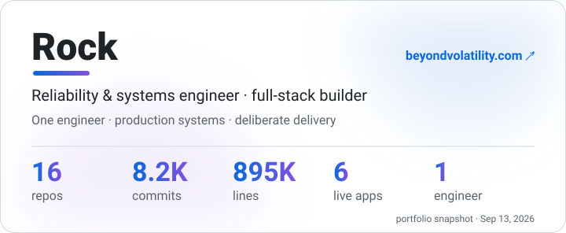
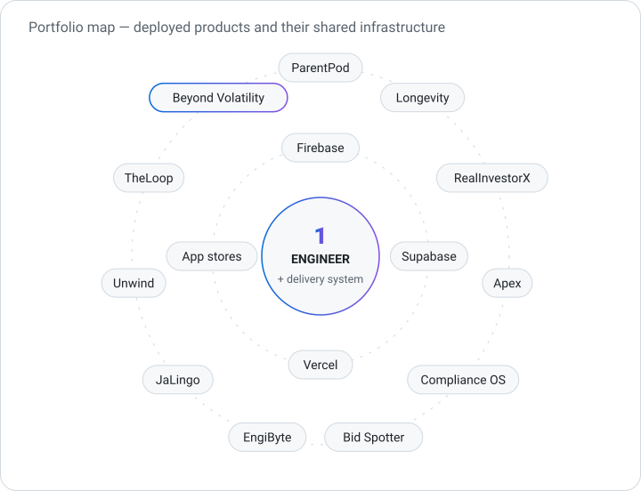
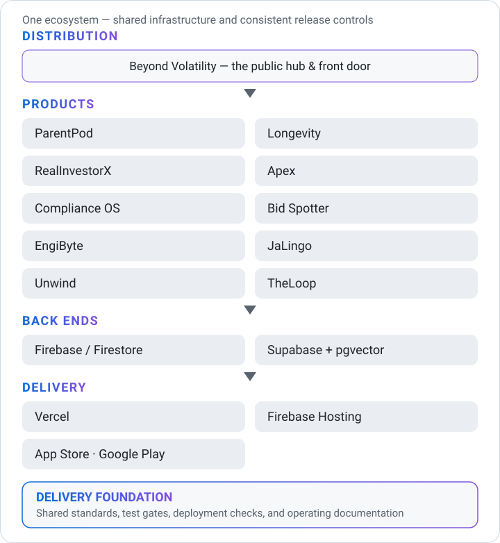
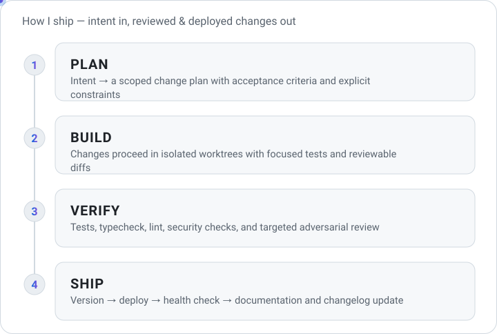
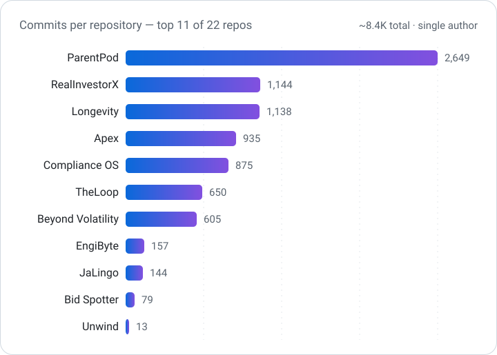
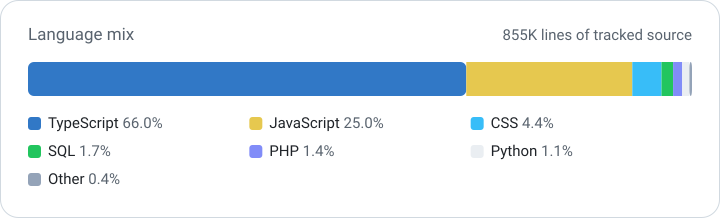
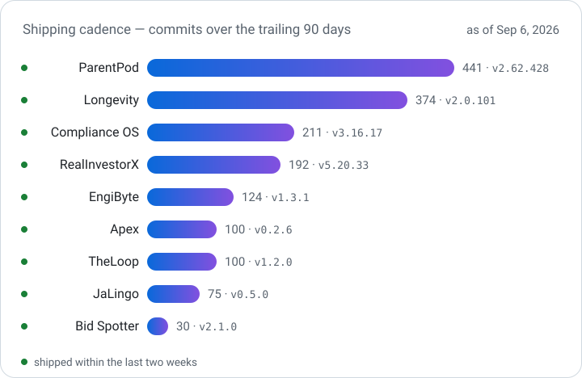

<picture>
  <source media="(prefers-color-scheme: dark)" srcset="assets/hero.dark.svg">
  
</picture>

  
  
  
  
  
  
  
  
  
  

  <a href="#what-i-build">What I build</a>
  &nbsp;·&nbsp;
  <a href="#the-ecosystem">Ecosystem</a>
  &nbsp;·&nbsp;
  <a href="#how-i-ship">How I ship</a>
  &nbsp;·&nbsp;
  <a href="#by-the-numbers">By the numbers</a>
  &nbsp;·&nbsp;
  <a href="#recently-shipped">Recently shipped</a>
  &nbsp;·&nbsp;
  <a href="#selected-work">Selected work</a>
  &nbsp;·&nbsp;
  <a href="#engineering-practices">Practices</a>
  &nbsp;·&nbsp;
  <a href="#connect">Connect</a>

## What I build

By day, I lead reliability-compliance work in the energy sector. Outside that role, I design, build, ship, and operate the products below, using a review-and-test system to keep changes traceable.

**Currently**

- Operating **ParentPod** across web, iOS, and Android while improving the caregiver onboarding path.
- **Longevity** turns one short daily log into a read on today's energy, comparisons drawn from your own history, and the long view.
- Maintaining the shared delivery system: isolated worktrees, automated tests, security gates, deployment checks, and documentation freshness.

## The ecosystem

14 repositories, one system: a shared hub for distribution, a portfolio of products, two back ends, and native + web delivery connected by common release controls.

<picture>
  <source media="(prefers-color-scheme: dark)" srcset="assets/orbit.dark.svg">
  
</picture>

<picture>
  <source media="(prefers-color-scheme: dark)" srcset="assets/ecosystem.dark.svg">
  
</picture>

## How I ship

<picture>
  <source media="(prefers-color-scheme: dark)" srcset="assets/pipeline.dark.svg">
  
</picture>

Shared standards and repository-specific release gates connect each change to tests, review, deployment verification, and documentation updates.

| Command | What it does |
|---|---|
| `/ship` | release gate — version, build, test, deploy, verify, update docs |
| `/sync` | rebase main and resolve mechanical conflicts with validation |
| `/audit` | security, dependency, dead-code, a11y & perf sweep |
| `/new-project` | scaffold a repo with baseline standards, CI, security checks, and documentation |
| `/update-brain` | maintain the knowledge base and reconcile the task hub |
| `/improve` | turn repeatable workflows into maintained tooling and checks |

**Shared engineering standards:** `architecture` · `coding-standards` · `typescript` · `react` · `security` · `git-workflow` · `startup` — maintained centrally and applied according to each repository's stack and risk profile.

## By the numbers

Portfolio snapshot dated Aug 27, 2026. These figures are computed from the git history and tracked source tree; the visible date prevents an old snapshot from presenting as live telemetry.

<picture>
  <source media="(prefers-color-scheme: dark)" srcset="assets/commits.dark.svg">
  
</picture>

<picture>
  <source media="(prefers-color-scheme: dark)" srcset="assets/languages.dark.svg">
  
</picture>

## Recently shipped

<picture>
  <source media="(prefers-color-scheme: dark)" srcset="assets/velocity.dark.svg">
  
</picture>

Still shipping — latest version and commit volume over the last 90 days, as of Aug 27, 2026. Regenerated from git, not hand-edited.

| Product | Latest | Commits · 90d |
|---|---|---|
| **ParentPod** | `v2.62.402` | 432 |
| **Longevity** | `v2.0.87` | 360 |
| **RealInvestorX** | `v5.20.18` | 170 |
| **Apex** | `v0.2.5` | 120 |
| **EngiByte** | `v1.3.0` | 108 |
| **Compliance OS** | `v3.7.6` | 98 |
| **TheLoop** | `v1.1.11` | 87 |
| **JaLingo** | `v0.5.0` | 64 |

## Selected work

| Project | What it does | Stack | Live |
|---|---|---|---|
| **[ParentPod](https://parentpodapp.com)**  `Flagship · live` | A shared baby tracker for the whole care team. | TypeScript · React · Vite · Capacitor · Firebase | [App Store ↗](https://apps.apple.com/app/parentpod/id6759841193) · [Play ↗](https://play.google.com/store/apps/details?id=com.parentpod.app) |
| **[Longevity](https://longevity.beyondvolatility.com/)**  `Live` | See what your days are doing to your energy. | TypeScript · Next.js · React · Capacitor · Firebase | [Live ↗](https://longevity.beyondvolatility.com/) |
| **[RealInvestorX](https://realinvestorx.beyondvolatility.com/)**  `Maintenance mode` | Real-estate deal review with explicit assumptions. | TypeScript · React · Express · Turborepo · Supabase | [Live ↗](https://realinvestorx.beyondvolatility.com/) |
| **[Apex](https://apex.beyondvolatility.com/)**  `Maintenance mode` | Personal-finance & FIRE planning. | TypeScript · React · Vite · Supabase | [Live ↗](https://apex.beyondvolatility.com/) |
| **[Compliance OS](https://compliance.beyondvolatility.com/)**  `Parked · maintained` | Controls & audit-evidence platform. | TypeScript · React · Firebase | [Live ↗](https://compliance.beyondvolatility.com/) |
| **[EngiByte](https://engibyte.beyondvolatility.com)**  `Live · revived 2026-07-11` | Scroll less. Know more. | TypeScript · React Native · Expo · Firebase | [Live ↗](https://engibyte.beyondvolatility.com) |
| **[JaLingo](https://jalingo.beyondvolatility.com)**  `Live · founders season` | Learn Patwa from the people who speak it. | TypeScript · Next.js · React · Firebase | [Live ↗](https://jalingo.beyondvolatility.com) |
| **[TheLoop](https://theloop.beyondvolatility.com/)**  `Controlled beta · live` | A private chronological feed for people you know. | TypeScript · React · Vite · Firebase | [Live ↗](https://theloop.beyondvolatility.com/) |
| **[Beyond Volatility](https://beyondvolatility.com)**  `Live` | The hub — the front door to the portfolio. | WordPress · PHP | [Live ↗](https://beyondvolatility.com) |

<b>ParentPod — deep dive</b>

**Problem.** Caring for a baby is a team sport, but the tools assume one logged-in parent — state fragments across people and devices.

**Architecture.** React + Vite in a Capacitor shell (one codebase → iOS, Android, Web). Firestore provides real-time multi-caregiver sync; security rules enforce role-scoped access server-side; RevenueCat handles cross-platform subscriptions.

**Engineering.** Local-first activity capture reconciles through Firestore, with separate tested release paths for the web and native stores.

<b>Full stack &amp; tooling</b>

**Languages**  
     

**Frontend**  
     

**Backend**  
     

**Infra & delivery**  
    

**Quality & tooling**  
     

## Engineering practices

- **Typed contracts and boundary validation** are required for new or changed external inputs.
- **Test the behavior and the failure path** — a bugfix starts with a failing test that reproduces it.
- **Secrets stay out of source control** — builds and deploys receive them through environment configuration or managed secret stores; only public client configuration ships.
- **Authorization belongs server-side** — Firestore rules and Supabase RLS protect current privileged paths; known legacy gaps remain explicitly gated.
- **Tiered CI** (active / dabble / parked) keeps Actions minutes low; CLI-first deploys through the release gate.
- **Conflicts are resolved before merge** — semantic conflicts stop for review and a new validation pass.
- **Accessibility & cross-platform** — semantic markup, keyboard paths, and Capacitor guards for native builds.

## Connect

  
  
  
  
  
  
  

---

App repositories are private — this work ships to production, not public forks. This entire page — copy, tables, and every animated SVG (light + dark) — is generated from data (<a href="data/projects.json">projects.json</a> + <a href="data/activity.json">activity.json</a>) by <a href="scripts/generate-showcase.mjs"><code>generate-showcase.mjs</code></a> and refreshed by a stamp-guarded local schedule. Short link to this page → <b><a href="https://github.com/rockeish">github.com/rockeish</a></b> · full portfolio → <b><a href="https://beyondvolatility.com">beyondvolatility.com</a></b>.
